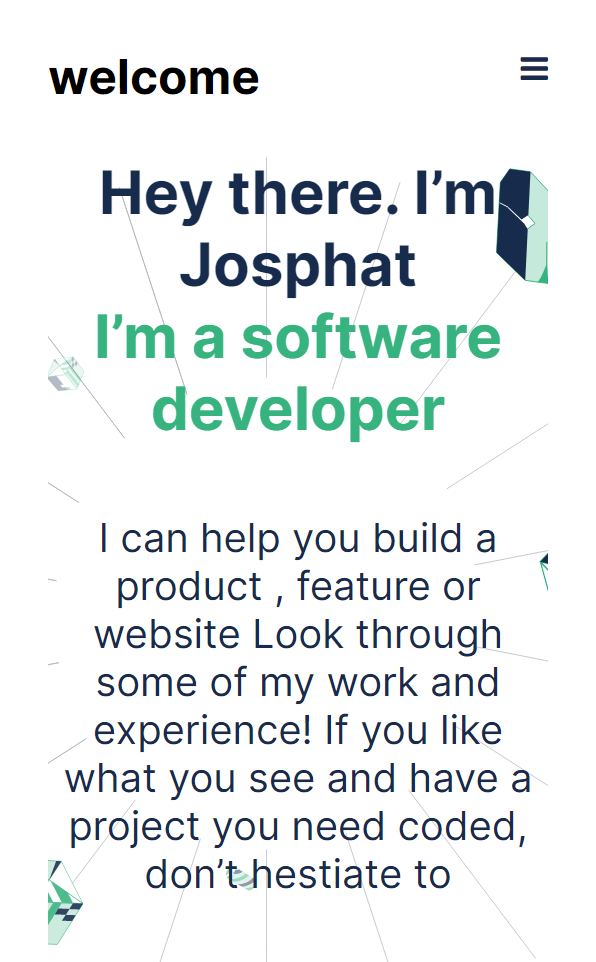

# Project Name

> One paragraph statement about the project.

Additional description about the project and its features.

## Built With

- html
- css
- vscode

## Live Demo

[Live Demo Link](https://zairdon20.github.io/JOSPHATS-FIRST/)

[Online view link ](https://zairdon20.github.io/JOSPHATS-FIRST/)

### Prerequisites

### Setup

### Install

### Usage

### Run tests

### Deployment

## Authors

👤 **Josphat**

- GitHub: [zairdon20](https://github.com/githubhandle)
- Twitter: [@Josphatnkonde1](https://twitter.com/twitterhandle)
- LinkedIn: [Josphat Nkonde](https://linkedin.com/in/linkedinhandle)

Contributions, issues, and feature requests are welcome!

Feel free to check the [issues page](../../issues/).

## Show your support

Give a ⭐️ if you like this project!

## Acknowledgments

- Hat tip to anyone whose code was used
- Inspiration
- etc

## 📝 License

This project is [MIT](./MIT.md) licensed.
